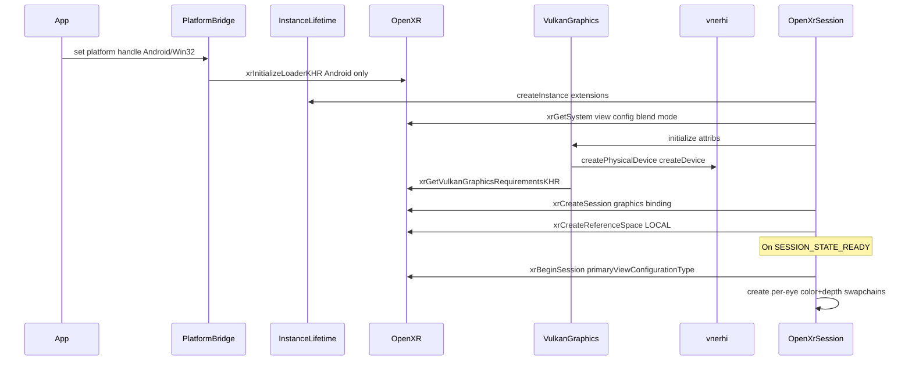

# OpenXR backend design (vnexr)

Canonical architecture for the OpenXR session/compositor backend on **Android, Windows, and Linux**. User-facing API notes live in [xr.md](xr.md); coordinate conventions in [conventions.md](conventions.md).

## Goals and non-goals

**Goals**

- Production OpenXR on Android (Quest, Samsung Galaxy XR), Windows (Monado, Meta Link), and **Linux** (Monado / desktop VR dev) via **vnerhi Vulkan**.
- Thin `OpenXrSession` orchestrator delegating to focused modules (vnerhi backend layout).
- Per-eye color + depth swapchains, real composition layers, view/projection matrices, Khronos Ch.4 input.
- `Result` + `VNE_XR_CHECK` error model aligned with vnerhi.

**Non-goals**

- Vendoring Khronos `GraphicsAPI_*`, Diligent `OpenXRUtilities.h`, or monolithic tutorial classes.
- OpenXR on Apple (visionOS uses CompositorServices).
- D3D11/D3D12/OpenGL graphics bindings.
- `XR_FB_passthrough`, hand-tracking mesh (later phase).

## Layering

| Layer | Location | Contents |
|-------|----------|----------|
| Public API | `include/vertexnova/xr/` | `ISession`, `Frame`, `InputState`, `xr_error.h`, `xr_factory.h` |
| Core | `src/vertexnova/xr/core/` | Factory, null backend |
| OpenXR backend | `src/vertexnova/xr/backend/openxr/` | All OpenXR implementation (never in `include/`) |

Mirrors vnerhi: `IDevice` in `include/`, `VulkanDevice` in `src/.../backend/vulkan/`.

## Module map

```
src/vertexnova/xr/backend/openxr/
├── openxr_util.h                    OPENXR_CHECK, extension enumeration
├── openxr_instance_lifetime.{h,cpp} Shared XrInstance ref-count
├── openxr_platform_handle.{h,cpp}   Win32 HWND / Android activity
├── openxr_session.{h,cpp}           ISession orchestrator
├── graphics/
│   ├── openxr_vulkan_graphics.{h,cpp}
│   ├── openxr_vulkan_binding.{h,cpp}
│   └── openxr_vulkan_texture.{h,cpp}
├── presentation/
│   ├── openxr_swapchain_bridge.{h,cpp}
│   └── openxr_composition_layer.{h,cpp}
├── input/
│   └── openxr_input.{h,cpp}
├── math/
│   └── openxr_math.{h,cpp}
└── platform/
    ├── openxr_android.cpp
    └── openxr_debug.{h,cpp}
```

One primary class per header; `snake_case` filenames with `openxr_` prefix.

## Bootstrap sequence



Prefer `XR_KHR_vulkan_enable2` when available; fall back to `XR_KHR_vulkan_enable`. Graphics binding is filled from `VulkanDevice::getVulkanInstance()`, `getVulkanPhysicalDevice()`, `getVulkanDevice()`, `getVulkanGraphicsQueueFamily()`.

## Ownership and RAII

| Resource | Owner | Destroy order |
|----------|-------|---------------|
| `XrInstance` | `OpenXrInstanceLifetime` (ref-counted) | After last session user unregisters |
| `XrSession` | `OpenXrSession` | Before instance destroy |
| `XrSpace` (reference) | `OpenXrSession` | Before session destroy |
| Action spaces | `OpenXrInput` | Before session destroy |
| Swapchains | `OpenXrSwapchainBridge` | Before session destroy; after `xrEndSession` on STOPPING |
| `vne::rhi::IDevice` | `OpenXrVulkanGraphics` | Before instance destroy |

Shutdown order: `xrEndSession` → destroy swapchains → destroy input → destroy spaces → `xrDestroySession` → release graphics device → `xrDestroyInstance`.

## vnerhi interop

- Swapchain images are compositor-owned `VkImage` handles wrapped by `OpenXrVulkanTexture` (`isWrappedImage() == true`).
- Apps render via `Frame::surfaces.views[i].color_texture` / `depth_texture`.
- Before `xrReleaseSwapchainImage`, call `OpenXrSession::flushGpu()` (queue wait idle / finish frame).
- Depth swapchains are created for rendering; depth composition layer submission is deferred.

## Error model

`include/vertexnova/xr/xr_error.h` defines `vne::xr::Result` and `VNE_XR_CHECK` (parallel to vnerhi `rhi_error.h`). Internal modules return `Result`; `ISession` keeps `bool` convenience at the public boundary.

`xrResultToString(XrResult)` maps OpenXR failures to log messages.

## Frame pipeline

```mermaid
flowchart LR
  poll[pollEvents] --> begin[beginFrame]
  begin --> acquire[acquire swapchains]
  begin --> locate[xrLocateViews]
  begin --> matrices[view/proj matrices]
  begin --> input[pollInput actions]
  begin --> app[IRenderSession update]
  app --> flush[flushGpu]
  flush --> compose[build composition layer]
  compose --> release[release swapchains]
  release --> end[xrEndFrame]
```

`beginFrame` only runs `xrWaitFrame` / `xrBeginFrame` when session is running (`SYNCHRONIZED`, `VISIBLE`, or `FOCUSED`).

## Platform bridges

| Platform | File | Responsibility |
|----------|------|----------------|
| Android | `platform/openxr_android.cpp` | `xrInitializeLoaderKHR`, `native_app_glue` entry |
| Windows | `openxr_platform_handle.cpp` | HWND / instance proc for optional extensions |

Portable logic stays in `.cpp`; platform files expose small `noexcept` init functions.

## Testing

- **CI**: `NullSession` backend (no OpenXR runtime).
- **Optional**: `tests/backend/openxr/` gated on `VNE_XR_WITH_OPENXR`.
- **Manual**: `03_hello_openxr` (Android, Linux), `04_openxr_windows` (Win32 loop).

## References

- Khronos OpenXR tutorial Ch.4 (input, haptics, block interaction patterns).
- Diligent T28 HelloOpenXR (bootstrap order, per-eye swapchains, `XrCreateProjectionFov`, WinMain loop).
- vnerhi `backend/vulkan/` module layout and `rhi_error.h`.
