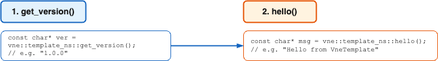

# VertexNova Template

## Overview

VneXR is a minimal C++ project template for the VertexNova ecosystem. It provides a standard layout (include, src, tests, examples), CMake setup with vnecmake, optional internal deps (vnecommon, vnelogging), and a tiny API so you can build and run out of the box. Use it as a starting point for new libraries or applications.


**Figure 1: Context Diagram**

| Element | Description |
|---------|-------------|
| C++ Application | Developer/user code (tests, examples, or your app) that uses the template API |
| VneXR | Template library; provides `get_version()`, `hello()`, and the project scaffold |

## Project layout and build

The template follows a standard directory layout and builds one library per build (static or shared), plus tests and optional examples. The library target is always `vnexr` with alias `vne::xr`.


**Figure 2: Project layout and build**

| Element | Description |
|---------|-------------|
| include/vertexnova/xr/ | Public API headers (e.g. `xr.h`) |
| src/vertexnova/xr/ | Implementation |
| tests/ | Unit tests (Google Test) |
| examples/ | Example apps (e.g. `01_hello_xr`) |
| cmake/vnecmake/ | CMake modules submodule |
| deps/internal/, deps/external/ | Internal (vnecommon, vnelogging) and external (googletest) deps |
| CMake configure + build | Produces one lib: `libvnexr.a` or `libvnexr.so` (or `.dylib`/`.dll`), plus tests and examples |

See the root [README.md](../../../README.md) for prerequisites, dependencies, and build commands.

## API usage

The public API lives in namespace `vne::xr_ns` and exposes two functions:



**Figure 3: API usage**

| Step | Function | Description |
|------|----------|-------------|
| 1 | `get_version()` | Returns the project version string (e.g. from `VERSION` file). |
| 2 | `hello()` | Returns a greeting string (minimal placeholder). |

Example:

```cpp
#include <vertexnova/xr/xr.h>

const char* ver = vne::xr_ns::get_version();  // e.g. "1.0.0"
const char* msg = vne::xr_ns::hello();        // e.g. "Hello from VneXR"
```

## CMake options

| Option | Default | Description |
|--------|---------|-------------|
| `VNE_XR_TESTS` | ON | Build unit tests. |
| `VNE_XR_EXAMPLES` | ON (dev/top-level) / OFF (submodule) | Build examples (on by default in dev builds, off when used as a submodule). |
| `VNE_XR_LIB_TYPE` | shared | Library type: `static` or `shared`. One library per build; target is always `vnexr` (alias `vne::xr`). |
| `WARNINGS_AS_ERRORS` | OFF | Treat compiler warnings as errors. |
| `ENABLE_DOXYGEN` | OFF | Generate Doxygen documentation. |

## Static vs shared for deployment

- **Static** (`-DVNE_XR_LIB_TYPE=static`): Single executable, no runtime lib to ship. Best for one-binary deploy.
- **Shared** (`-DVNE_XR_LIB_TYPE=shared`, default): For plugins, many apps sharing one lib, or ABI versioning. Preferred for **cross-platform GL / multibackend** libs (one `libvnexr.so` plus backend plugins).

## Documentation

- **This document:** `docs/vertexnova/xr/xr.md`
- **Diagrams:** `docs/vertexnova/xr/diagrams/` (Draw.io sources; export to PNG as described in [diagrams/README.md](diagrams/README.md))
- **API reference:** Generated by Doxygen when `-DENABLE_DOXYGEN=ON` (see root README)
